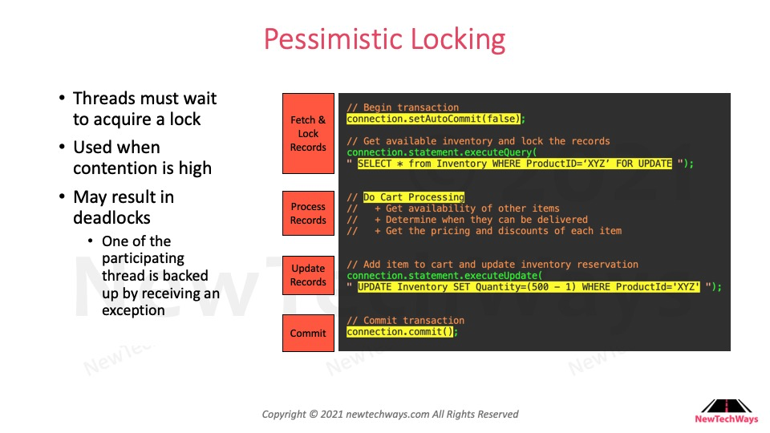

# 25. Pessimistic Locking

**Highlight:**

.png>)

**Summarize:**

\- Pessimistic locking definition:&#x20;

&#x20;   \+ When many threads try to get a lock of shared resources, the thread that it can get the lock will start processing the logic, other threads will be waiting for the processing thread to release.

&#x20;   \+ If a thread can't get a lock, it will wait.

\- Usage: use for the shared resources that they are very high contention.
