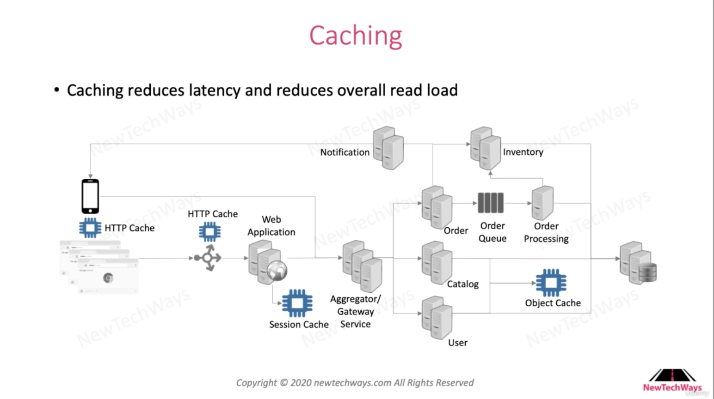

# 55. Caching for scalability

**Summarize:**

\- The hardest thing to scale our system is Database.

\- Caching helps us reduce read loads to DB so that the DB will increase the load of write operations.
