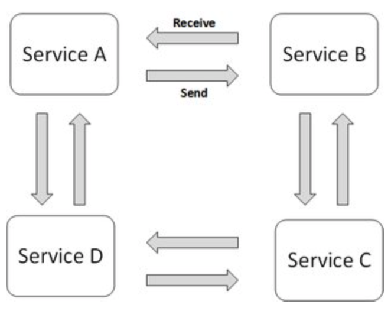

# 78. Event driven transactions

.png>)

**Highlight:**

**In failure case (Compensating transaction):**

**Summarize:**

**- Orchestration:**

**-** **Choreography:**

**Choreography vs. Orchestration:**

\- From the perspective of composing Web services to execute business processes, orchestration is a more flexible paradigm and has the following advantages over choreography:\
\- The coordination of component processes is centrally managed by a known coordinator.\
\- Web services can be incorporated without their being aware that they are taking part in a larger business process.\
\- Alternative scenarios can be put in place in case **** of faults occur.

**Ref**\
****[https://stackoverflow.com/questions/4127241/orchestration-vs-choreography](https://stackoverflow.com/questions/4127241/orchestration-vs-choreography)

[https://solace.com/blog/microservices-choreography-vs-orchestration/](https://solace.com/blog/microservices-choreography-vs-orchestration/)
